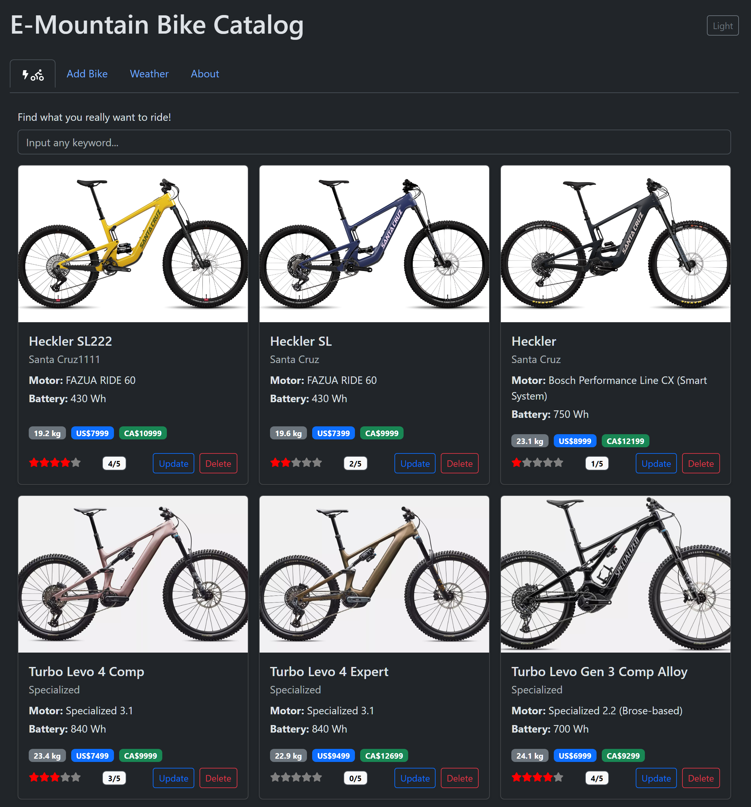
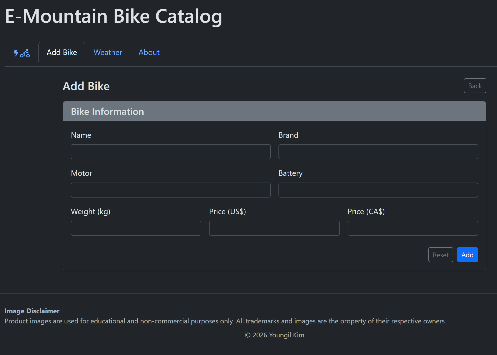
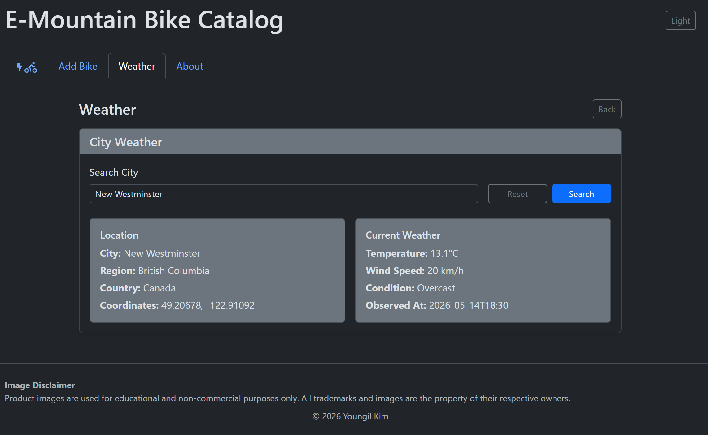
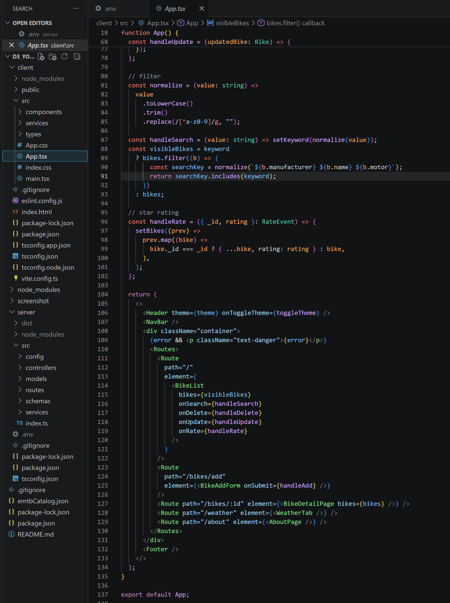

# e-Mountain Bike Catalog

## Live Demo

The application is deployed on Render with the frontend and backend hosted separately.

- **Live Application:** https://emtb-catalog-client.onrender.com
- **Backend API:** https://emtb-catalog.onrender.com
- **Bikes API:** https://emtb-catalog.onrender.com/api/bikes

> **Note:** The backend is hosted on Render's free tier. The first request may take a few moments if the service has been inactive.

## Local Development

### MongoDB Setup

For local development, use MongoDB Compass to import the sample bike catalog.

The sample dataset is provided in `emtbCatalog.json` in the project root directory.

1. Open MongoDB Compass.
2. Create a database and collection with the following values:
   - **Database:** `bike_catalog`
   - **Collection:** `bikes`
3. Open the `bikes` collection.
4. Select **Add Data** → **Import JSON or CSV file**.
5. Select `emtbCatalog.json` from the project root.
6. Import the data.

After importing the dataset, configure the server's MongoDB connection in the `.env` file.

### Local URLs

When running the application locally:

- **Client:** `http://localhost:5173`
- **Server:** `http://localhost:5000`
- **Bikes API:** `http://localhost:5000/api/bikes`

### Environment Variables

The server requires a MongoDB connection string:

```env
MONGODB_URI=your_mongodb_connection_string
```

The client can use the following environment variable to specify the API server:

```env
VITE_API_URL=http://localhost:5000
```

For deployment, `VITE_API_URL` should point to the deployed backend instead:

```env
VITE_API_URL=https://emtb-catalog.onrender.com
```

### 0. Project Motivation

- Built from a rider’s perspective as an e-mountain bike catalog
- Started from a real frustration: existing bike catalogs were often hard to compare, filter, and understand
- Reflects my current skills and learning approach
- Focused on practical, widely used technologies that were realistic to learn within a limited timeframe
- Designed as a solid foundation for a more complete production-ready application

### 1. TypeScript Adoption

- This project also serves as a portfolio project demonstrating my technical skills, coding style, and learning progress
- Implemented in **TypeScript**
- Chosen to learn React in a more structured and practical way
- Useful for building maintainable code with stronger type safety

### 2. Design Focus

- Prioritizes **clarity, structure, and correctness** over visual complexity
- Built with a simple and clean UI using **Bootstrap**
- Uses a card-based layout for consistent presentation
- Supports dark mode with Bootstrap theming
- Handles search on the frontend for fast and responsive filtering

### 3. UI Design Detail

- Update functionality is integrated directly into the card-based design
- Aims to keep interaction intuitive and visually consistent

### 4. Modular Structure

- Modular client-side structure, including:
  - API client
  - HTTP service
  - Geocoding service
  - Weather service
- Modular server-side structure, including:
  - routes
  - controllers
  - services
- Structured to make the code easier to understand, revise, and extend

### 5. Validation and Model Alignment

- Validation is implemented with **Zod**
- Frontend validation schemas are aligned with backend model design
- Helps improve consistency and reduce input errors

### 6. External API Integration

- Integrates external weather features using **Open-Meteo**
- Uses both:
  - Geocoding service
  - Weather service
- Adds practical real-world functionality to the application

### 7. Supporting Tools

- Uses **dotenv** for environment variable management
- Uses **react-markdown** to render the About page from `README.md`

### 8. Data Source

- Uses both **MongoDB Atlas** data and local development data

### 9. Reflection

- Built on my previous experience as a Python-based full-stack developer using Ajax, Django, Pandas, and PostgreSQL
- This project helped me transition into a new stack: **React, Axios, Express, MongoDB, and TypeScript**
- Helped me understand a different development style and ecosystem
- Confirmed that I enjoy organizing code, structuring modules, and designing clear data flow
- Bootstrap was a practical choice for efficient and consistent UI design
- The project required more time than I expected, but it became one of the most valuable learning experiences in my studies

## Architecture

### Client

- Component-based UI with TypeScript
- Service layer for bike, geocoding, weather, and HTTP logic
- Strong typing and schema-based validation

### Server

- Structured by role:
  - routes
  - controllers
  - services
  - models
  - schemas
- MongoDB-based data handling with Express API routes

## Data Source

- Uses both MongoDB Atlas data and local development data
- Images are loaded from the `public` folder using image keys

## File Structure

```txt
└── D3_YoungilKim
    ├── client
    │   └── src
    │       ├── components
    │       │   ├── AboutPage.tsx
    │       │   ├── BikeAddForm.tsx
    │       │   ├── BikeCard.tsx
    │       │   ├── BikeDetailPage.tsx
    │       │   ├── BikeList.tsx
    │       │   ├── Footer.tsx
    │       │   ├── Header.tsx
    │       │   ├── NavBar.tsx
    │       │   ├── SearchBox.tsx
    │       │   ├── Star.tsx
    │       │   ├── StarRating.tsx
    │       │   ├── ThemeToggleButton.tsx
    │       │   └── WeatherTab.tsx
    │       ├── services
    │       │   ├── api-client.ts
    │       │   ├── bike-service.ts
    │       │   ├── geocoding-service.ts
    │       │   ├── http-service.ts
    │       │   └── weather-service.ts
    │       ├── types
    │       │   └── bike.types.ts
    │       ├── App.css
    │       ├── App.tsx
    │       ├── index.css
    │       └── main.tsx
    ├── server
    │   └── src
    │       ├── config
    │       │   └── db.ts
    │       ├── controllers
    │       │   └── bike.controller.ts
    │       ├── models
    │       │   └── Bike.ts
    │       ├── routes
    │       │   └── bikeRoutes.ts
    │       ├── schemas
    │       │   └── bike.schema.ts
    │       ├── services
    │       │   └── bike.service.ts
    │       └── index.ts
    ├── package.json
    └── README.md
```

## Installation

```bash
npm run install:all
npm run dev
```

## Notes

- Both client and server must be running for full functionality
- Validation is enforced with Zod schemas
- The project prioritizes structure and correctness over visual complexity

## Screenshots

### Home / Bike Catalog Page



### Add Bike Form



### Weather Feature



### Code Structure and Main App Logic


